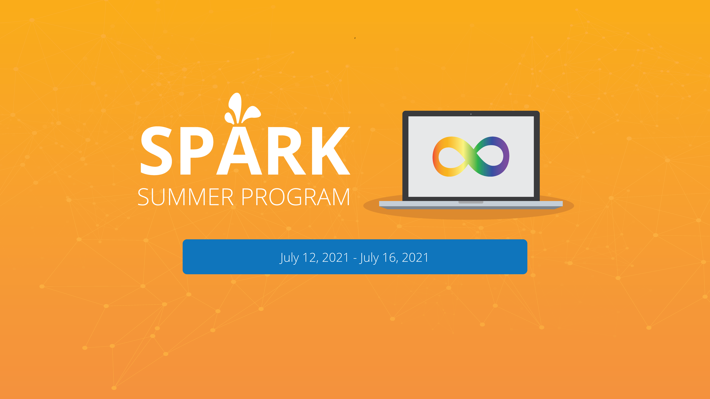

# SPARK 2021: Shared Repository
The shared repository for SPARK. SPARK is an employment-readiness program that focuses on teaching data science-related skills run by Holland Bloorview's Autism Research Centre and lead by Dr. Azadeh Kushki. 
Our first summer iteration of the program was held from *July 12, 2021 to July 16, 2021*. The repository contains the different projects that the participants worked on under the guidance of program facilitators. 

# Contributors
<<<<<<< HEAD
- [Santiago Condori](profiles/santiago)
- [Jenny Nguyen](profiles/jenny)
- [Jonathan Nayler](profiles/jonathan)
- [Maryam Mahjoob](profiles/maryam)
- [Beto Rico](profiles/beto)
- [Felix Lee](profiles/felix)
- [Bilal Syed](profiles/bilal)
- [Victoria Johnston](profiles/victoria)
=======
- Santiago Condori
- Jenny Nguyen
- Jonathan Nayler
- Maryam Mahjoob
- Beto Rico
- Felix Lee
- Bilal Syed
- Victoria Johnston
- Felicia Liu
>>>>>>> bcb0c161428f8952fd0abb7edc71554c967d1d24

# Special thanks to our guest speakers
- Alex Barnes
- Spencer Arshinoff
- Julia Nguyen 

# Groups
For SPARK, we have broken up into two different groups. In each group, we have chosen a dataset from **Kaggle** to answer some question about the data. 

## Group 1
Group 1 is exploring a dataset of Star Wars characters. Please check out their project [here](/group_01).

You can view Group 1's presentation [here](https://docs.google.com/presentation/d/1grtWxGA0-7542V9TG93ytt8yO63dWdd0XY99TBITCaY).

## Group NarWolves
Group NarWolves is exploring a dataset Marvel vs DC films and their IMDB rating. Please check out their project [here](/group_02).

You can view Group NarWolves' presentation [here](https://docs.google.com/presentation/d/16R5z-_tQTbvgJ-_srTK0rWX83MEnDqjU7_xnoNeDf-8).
