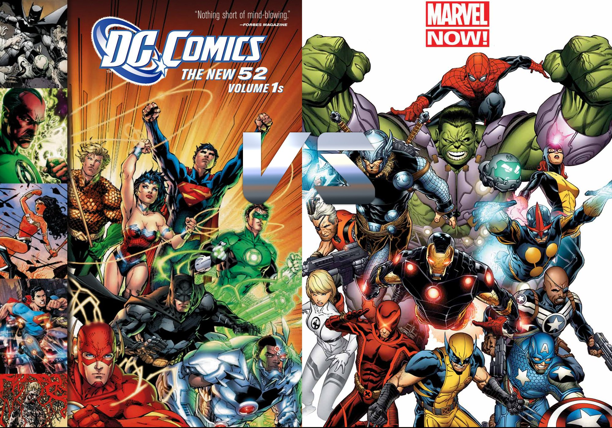

# Group 2: The_NarWolves

## Contributors
- Santiago Condori
- Felix Lee
- Jenny Nguyen
- Jonathan Nayler
- Felicia Liu
 
## Group Motto
-  Pierce Like A NarWolf! They're Teeth, Not Horns!

## Our Project

### The Dataset

This data set contains information about major movies in the DC and Marvel universes. The features of this data set include the name of the movie the year the runtime and IMDB scores.  

You can take a look at the [notebook](group_2_analysis.ipynb) to see our analysis. 
You can also take a look at our [slides](https://docs.google.com/presentation/d/16R5z-_tQTbvgJ-_srTK0rWX83MEnDqjU7_xnoNeDf-8/e) too!

### Objectives
- Are DC films rated higher than Marvel films or is it the other way around?
- Are longer rated films higher than shorter films?
- Are Iron Man films better than films featuring Superman?
- Which actors appear in the most movies?
- Are Marvel or DC films shorter or longer?
- Does age restriction relate to movie run time?
- Are there more female or male actors in these films?

### Basic Stats
- 1442 data points
- The mean score of both Marvel and DC movies is 7.85
- The mean run time is 39.9 
- The IMDB score for both Marvel and DC movies range from 1.1 to 9.6 (that’s a really big range)
- The standard deviation of both Marvel and DC movies is 0.895 (most of the scores are around 7 to 8.7)
- There are about 1166 DC movies and 276 Marvel movies in our dataset
- DC has a higher mean IMDB score than Marvel and Marvel has a higher Metacritic than DC. In general, Marvel flims tend to gross more in the US than DC films 
- When comparing stand-alone movies, Marvel had a higher IMDB score than DC. When comparing series, DC had a higher IMDB rating than Marvel
